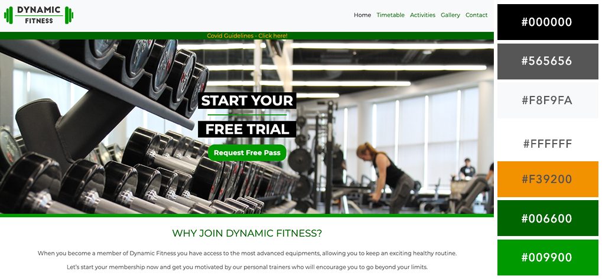

# Dynamic Fitness Gym

A mobile friendly and responsive website, designed and elaborated to attract new customers and to provide information related to classes, activities like boxing, climbing and bodybuilding. 

## Showcase

[Visit Live Site Here!](https://raphamsa.github.io/raphamsa-milestone1/)

# UX

**Dynamic Fitness Gym** would like to have a website mainly to keep their customers informed of changes on classes timetables and to get new customers.
When a user accesses the website, he will be able to check which classes are available on a weekly basis. 

The user will be able to contact the gym for further queries using the contact form. The gallery section containing images and video will show how the gym facilities look inside. The types of modalities can be found on both home page and activities page.
The Free Trial Pass button on the callout section gives the company an opportunity to attract new customers to visit the gym facilities.

## Wireframe

DESKTOP - 
[Home](https://raphamsa.github.io/raphamsa-milestone1/assets/wireframes/desktop/home.png)
.
[Timetable](https://raphamsa.github.io/raphamsa-milestone1/assets/wireframes/desktop/timetable.png)
.
[Activities](https://raphamsa.github.io/raphamsa-milestone1/assets/wireframes/desktop/activities.png)
.
[Gallery](https://raphamsa.github.io/raphamsa-milestone1/assets/wireframes/desktop/gallery.png)
.
[Contact](https://raphamsa.github.io/raphamsa-milestone1/assets/wireframes/desktop/contact.png)

MOBILE -
[Home](https://raphamsa.github.io/raphamsa-milestone1/assets/wireframes/mobile/home-2.png)
.
[Timetable](https://raphamsa.github.io/raphamsa-milestone1/assets/wireframes/mobile/timetable-2.png)
.
[Activities](https://raphamsa.github.io/raphamsa-milestone1/assets/wireframes/mobile/activities-2.png)
.
[Gallery](https://raphamsa.github.io/raphamsa-milestone1/assets/wireframes/mobile/gallery-2.png)
.
[Contact](https://raphamsa.github.io/raphamsa-milestone1/assets/wireframes/mobile/contact-2.png)

TABLET -
[Home](https://raphamsa.github.io/raphamsa-milestone1/assets/wireframes/tablet/home-3.png)
.
[Timetable](https://raphamsa.github.io/raphamsa-milestone1/assets/wireframes/tablet/timetable-3.png)
.
[Activities](https://raphamsa.github.io/raphamsa-milestone1/assets/wireframes/tablet/activities-3.png)
.
[Gallery](https://raphamsa.github.io/raphamsa-milestone1/assets/wireframes/tablet/gallery-3.png)
.
[Contact](https://raphamsa.github.io/raphamsa-milestone1/assets/wireframes/tablet/contact-3.png)

# Features

## Existing Features

Logo – It will bring the user to the Home Page when clicked.

Navigation Bar – It allows the user to navigate through all pages. It collapses for mobile and tablet view.

Modal – A link has been added below the navigation as a temporary alert.

Featured Image – Gives an overview of the gym equipment and training floor.

Timetable – Tables used to display a list of classes being offered at the Gym.

Gallery – To showcase an auto-play video and photos using Fancybox. 

Google Maps – Allow users to find where the gym is located on both Home and Contact Pages.

Social Media Icons – To connect the users to Facebook, Instagram and Youtube.

Contact Details – Added to every page displaying Company Address, Email and Telephone number clickable to make calls.

Contact Form – Allow users to send messages select if they wish to receive a Free Trial Pass.

## Features Left to Implement

Develop a system so the user can Pay for fees & memberships;

Member Area / Login;

Packages & Pricing Pages;

### Fonts

The typography chosen for this site: 

font-family: 'Montserrat', sans-serif;

font-weight: 400, 700;

### Icons

Facebook, Instagram, Youtube

### Colors

# Technologies Used

HTML5 – To develop the structure of the web page.

CSS3 - To style the visual of all pages.

Javascript – To give more functionality to buttons 

Bootstrap v4.3.1 – Used to add grids, nav etc and to make the website responsive. 

Jquery – DOM Manipulation.

Gitpod – IDE for the project development.

Github – To create repositories for the project.

Git – Used for version control.

Google Chrome Developer Tools – For website testing.

Unsplash – To download high resolution images.

Pexels – To download a video for the Gallery Page.

Balsamiq - To create the project wireframes.

Adobe Illustrator - Used to design a logo.

Adobe Photoshop – Used to crop, resize and edit image filters.

Fancybox – To create a gallery with controls.

Google Maps – Copied Embedded link and added to the page.

Fontawesome – Social Media Icons.

Google Fonts – Used google fonts by adding a stylesheet link to the page.

W3C Validation – Used to validate both HTML and CSS code.

# Testing

### Code Validation

W3C HTML Validator - Passed successfully!

Jigsaw CSS3 Validator – Passed successfully! 

### Responsiveness
The site has been extensively tested and is responsive on multiple devices:

www.responsivedesignchecker.com

Google Developer Tools

### Browser Compatibility

Desktop
•	Google Chrome
•	Mozilla Firefox
•	Safari

Mobile
•	Google Chrome
•	Safari

# Deployment

To deploy my project, I used GitHub Pages for the repository. To do this I took the following steps:
1. I selected settings and scrolled down to the GitHub Pages section.
2. Under the drop-down that labelled None and changed to to Master Branch in the Source section.
3. The paged then refreshed and in the GitHub Pages section there is a link to the website.
Link https://raphamsa.github.io/raphamsa-milestone1/

To clone the project and edit it locally on your computer you must take the following steps:
1. In the GitHub Repository you must click “Clone or Download”.
2. Copy the URL which pops up underneath.
3. Open you IDE of choice.
4. Open Git Bash.
5. Type `git clone and paste the URL` and hit Enter.
Clone link https://github.com/raphamsa/raphamsa-milestone1.git

# Credits

### Content

The content for this project was written by myself.

### Media

The images used for this project were downloaded from Unsplash.com

The video used in the gallery were obtained from Pexels.com

### Acknowledgements

I received inspiration for this project from a friend who recently opened a Gym so I would like to support his business.

Thanks to the CI Team and my Mentor Ignatius for his support through the project.